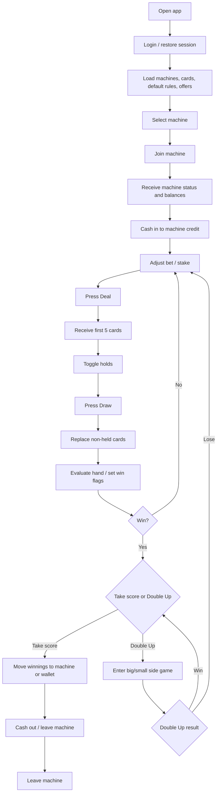

# Ai9Poker Clean-Room Rebuild Kickoff

## Intent

Use the APK as a **behavioral reference** to reconstruct a similar machine/video-poker experience in a clean-room way.

This document is for:

- rebuilding the gameplay loop
- mapping the state machine
- defining data models
- deciding what should stay client-side vs server-side
- recreating the "noise" and arcade feel without depending on opaque backend behavior

## Strongest Findings From The APK

### 1. The app is a machine-based video poker flow

The strongest game-specific signals are:

- `machine_selection_screen`
- `poker_game_screen`
- `getMachines`
- `GetAvailableMachines`
- `JoinMachine`
- `LeaveMachine`
- `MachineGameState`
- `getDefaultPokerRules`
- `loadDefaultRules`
- `getAllCards`
- `loadAllCards`

This is not a generic casino shell. It is built around joining a machine, managing credit, betting, dealing, drawing, scoring, and optionally entering double-up.

### 2. A significant part of game progression is driven by realtime updates

The client references:

- `https://www.ai9poker.com/CarrePokerGameHub`
- `SignalRService`
- `_subscribeToCommonMessages`
- `_subscribeToGameMessages`
- `machine_game_state`
- `member_balance_change`
- `BetPlaced`
- `MachineStatusChanged`
- `JoinedMachine`
- `updateDealtCardsFromSignalR`
- `handleDoubleUpFromSignalR`
- `addDoubleUpCardFromSignalR`
- `swapDoubleUpCardFromSignalR`
- `resetDoubleUpCardsFromSignalR`

The safest inference is:

- machine occupancy/state is server-tracked
- balances and stake changes are server-tracked
- card/deal/double-up updates are at least partially server-confirmed

### 3. Rule evaluation is explicit in the client

The APK exposes a surprising amount of rule vocabulary:

- `PokerRule`
- `PokerRule.fromJson`
- `startRuleEvaluation`
- `processRule`
- `_holdOnePair`
- `_holdTwoPair`
- `_holdThreeOfKind`
- `_holdFourOfKind`
- `_holdStraight`
- `_holdFlush`
- `_holdFullHouse`
- `_holdThreeCardFlush`
- `_holdFourCardFlush`
- `_holdFourCardStraight`

Named winning combinations include:

- `Royal Flush`
- `Straight Flush`
- `4 of a Kind`
- `Full House`
- `Flush`
- `Straight`
- `3 of a Kind`
- `2 Pair`

This strongly suggests the client does contain:

- hand evaluation logic
- hold recommendation or hold-resolution helpers
- paytable/rule metadata loaded from default rules

## Reconstructed Gameplay Loop

This is the most likely round structure based on the strings and controller names.

## Reconstructed Input Actions

The named UI action handlers give a good view of the interaction contract:

- `onBetPressed`
- `onBetLongPressStart`
- `stopBetRepeat`
- `onDealDrawPressed`
- `toggleHold`
- `onCancelHoldPressed`
- `onTakeScorePressed`
- `onBigPressed`
- `onSmallPressed`
- `onWithdrawPressed`
- `onMoveWinToWalletPressed`
- `onLeaveMachinePressed`

This implies the core controls are:

- bet increment
- deal/draw
- per-card hold toggles
- cancel holds
- take score
- double-up with `Big` / `Small`
- deposit/withdraw/cash out
- leave machine

## Reconstructed Domain Model

This is the minimum clean-room schema I would start with.

### PlayerWallet

- `walletBalance`
- `sessionToken`
- `memberId`
- `currentUserAmount`
- transaction history

### Machine

- `machineId`
- `machineName`
- `status`
- `machineAmount`
- `isOpened`
- `currentOccupant`

### MachineSession

- `machineId`
- `playerId`
- `machineCredit`
- `currentStake`
- `newBalance`
- `newWinAmount`
- `lostAmount`
- `bonusAmount`
- `rewardAmount`
- `winBonusAmount`
- `winBonusActive`
- `offerId`
- `inDoubleUp`

### Card

- `cardId`
- `title`
- `imagePath`
- `rank`
- `suit`
- `isHeld`

The APK exposes `Card1` through `Card5`, plus `Card1Image` through `Card5Image`, so a fixed 5-card board model is consistent with the current client.

### RuleProfile

- `ruleId`
- `ruleName`
- `minBetAmount`
- `maxBetAmount`
- paytable entries
- optional bonus thresholds:
  - `minStraightFlush`
  - `maxStraightFlush`
  - `minFullHouse`
  - `maxFullHouse`
  - `winBonusDefaultPokerRulesID`

### MachineGameState

This is likely what the hub pushes:

- `machineId`
- `currentStake`
- `machineAmount`
- current cards
- hold flags
- deal/draw phase
- latest win result
- double-up state
- bonus state

## Reconstructed Realtime Contract

The exact payloads are not visible, but the message names are good enough to draft a first version.

### Client -> server

- `joinMachine(machineId)`
- `leaveMachine(machineId)`
- place bet
- deal / draw request
- toggle hold
- take score
- double-up choice (`big` or `small`)
- cash in / cash out / transfer

### Server -> client

- `JoinedMachine`
- `MachineStatusChanged`
- `machine_game_state`
- `member_balance_change`
- `BetPlaced`
- dealt card updates
- double-up card updates
- available machine updates

If you want to keep the architecture close to this APK, a realtime authoritative session service is the right design.

## What The APK Tells Us About Randomness

### What is visible

The bundle exposes:

- `Random`
- `SecureRandom`
- `nextInt`
- `nextDouble`
- `ShuffleCard`
- `dealCount`
- `nextCard`
- `pickedBig`
- `Processing double-up...`

### What is not visible

There is no clearly named game RNG routine proving:

- local deck generation is authoritative
- double-up is fully client-decided
- payout randomness is computed only on device

Given the SignalR handlers, the better assumption is:

- local randomness is used for animation and some UI behavior
- final gameplay progression is probably server-confirmed

## How To Recreate The "Noise" Without Copying Hidden Logic

This is the part you care about most, and it should be designed deliberately.

The mistake would be trying to fake "noise" by secretly rigging outcomes in obvious ways. That gets predictable fast.

A better clean-room approach is to split the feeling into four layers:

### 1. True outcome randomness

Use a dedicated RNG stream for actual game outcomes:

- one shuffle RNG per hand
- one independent RNG per double-up round
- no reuse of RNG state between cosmetic and outcome systems

For development:

- log a per-round seed
- make every round replayable from seed

For production:

- use a cryptographically strong seed source on the server
- optionally use commit/reveal so outcomes are auditable internally

### 2. Presentation randomness

The arcade feel usually comes from timing variance more than math variance.

Add harmless variability to:

- reveal timing per card
- hold blink cadence
- coin spinner duration
- pause before final card reveal
- bonus banner timing
- deal sound cadence

This creates unpredictability in feel without biasing outcomes.

### 3. Near-miss choreography

If you want the machine to feel alive, use display choreography around honest outcomes:

- reveal non-held cards in dramatic order
- bias animation order toward suspense
- delay the card that resolves the hand
- highlight partial patterns before final resolution
- make double-up reveal order variable

This is where much of the "noise" should live.

### 4. Double-up design

The APK strongly suggests a `Big` / `Small` style double-up game.

To keep it from feeling predictable:

- keep double-up RNG separate from the base hand RNG
- avoid streak-smoothing hacks that create detectable patterns
- randomize reveal timing and card placement order
- track distribution during testing to ensure no visual routine exposes the result too early

If you want a controllable feel, shape **presentation**, not **outcome fairness**.

## Recommended Clean-Room Architecture

If the rebuild is meant to stay close to this app:

### Client

- Flutter if you want rapid parity with the existing mobile flow
- fixed 5-card board
- card image atlas
- state container for:
  - wallet
  - machine session
  - active hand
  - double-up state
  - animation state

### Server

- authoritative game session service
- authoritative deck / shuffle / double-up resolution
- wallet and transfer service
- machine occupancy service
- event hub / websocket layer

### Persistence

- players
- wallet ledger
- machine sessions
- hands
- round outcomes
- bonus triggers
- offers

### Realtime

You do not need SignalR specifically, but if you want parity with the analyzed app, SignalR maps cleanly to the observed structure.

## Suggested Sprint 1

Build the smallest playable vertical slice first.

### Goal

A single-machine local prototype with:

- cash in
- bet increment
- deal
- hold
- draw
- hand evaluation
- score take
- optional stubbed double-up

### Hard rules for Sprint 1

- no network yet
- deterministic seeded runs
- full action log per hand
- exact state snapshots after each action

### Deliverables

- `Card`, `Deck`, `Hand`, `RuleProfile`, `MachineSession` models
- hand evaluator
- hold/draw reducer
- paytable screen
- animation timing layer
- replay from seed

## Suggested Sprint 2

Introduce realtime server authority:

- join machine
- machine occupancy
- wallet sync
- authoritative deal/draw
- authoritative double-up
- event replay logs

## Suggested Sprint 3

Tune the arcade feel:

- reveal choreography
- animation randomness
- audio cadence
- bonus/offer hooks
- UX polish for machine join/leave/cashout flow

## What To Avoid

- building the clone around opaque server assumptions from this APK
- reusing protected code or assets directly in a shipped product
- mixing cosmetic RNG with gameplay RNG
- adding hidden outcome manipulation to simulate "noise"
- shipping before you can replay every round deterministically in development

## Best Immediate Next Step

Start by implementing a **local deterministic core**:

1. fixed 52-card deck
2. 5-card deal
3. hold/draw
4. hand evaluator
5. score / payout resolver
6. double-up mini-game
7. replay from seed

Then add:

8. animation noise
9. machine session wrapper
10. server authority

That gets you a project you can reason about, test, and tune instead of chasing hidden behavior from an obfuscated APK.
