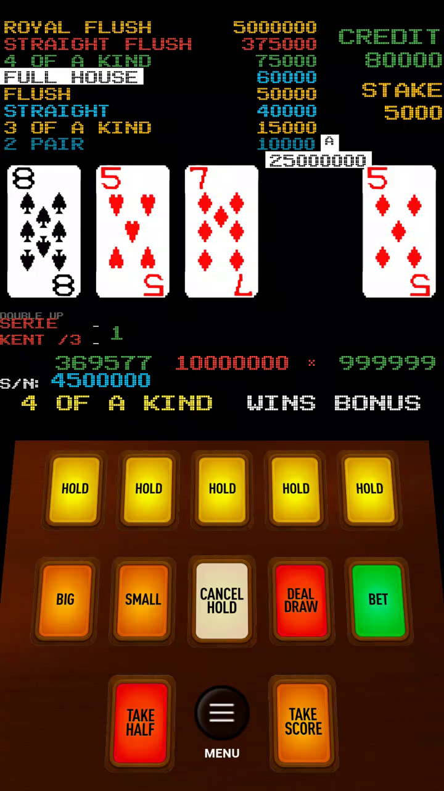
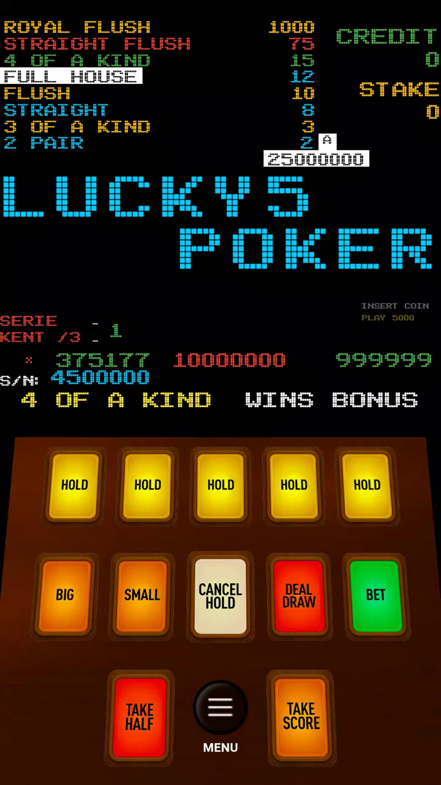

# Game Feel Reference

Primary source: the local gameplay recording set, with curated sample frames tracked in `docs/assets/recording/`

## Capture Metadata

- duration: `00:11:19`
- orientation: portrait
- frame size: `720x1280`
- frame rate: `30 fps`

## Visual Direction

- black CRT-like playfield with minimal chrome
- rainbow pixel paytable fixed at the top-left
- credit and stake counters fixed at the top-right
- oversized card row centered in the upper-middle
- warm brown control deck occupying the lower third
- beveled, glowing cabinet buttons instead of flat mobile controls

## Interaction Cues

- the game keeps the paytable visible during play
- `BIG` and `SMALL` live on the main control deck, not in a detached modal flow
- `TAKE HALF` and `TAKE SCORE` are first-class cabinet actions
- the title / idle state reuses the same machine screen instead of switching to a modern menu shell

## Reconstruction Constraints

- keep the cabinet silhouette intact
- keep portrait-first ergonomics
- use pixel or pixel-adjacent typography for paytable and status text
- keep the control deck physically chunky and color-coded
- avoid generic lobby UI, chip stacks, glossy casino theming, or modern card-table layouts

## Sample Frames

### 00:00:30

Notes:

- five-card playfield visible
- `DOUBLE UP` cue present
- amber button deck and red `DEAL / DRAW` button are clearly established

### 00:02:00

Notes:

- card art remains crisp and simple
- score, credit, and stake stay persistent
- there is no extra HUD clutter beyond machine essentials

### 00:06:00

Notes:

- idle/title mode still lives inside the cabinet screen
- machine identity is embedded into the playfield, not separated into a branding screen
- bottom controls remain visible even when no active hand is on screen
